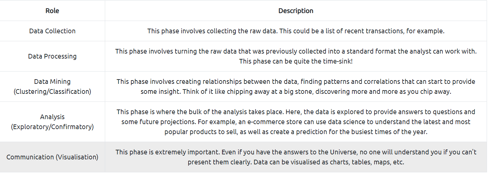

# O Data, All Ye Faithful


### Learning Objectives
- Get an introduction to what data science involves and how it can be applied in Cybersecurity
- Get a gentle (We promise) introduction to Python
- Get to work with some popular Python libraries such as Pandas and Matplotlib to crunch data
- Help McHoneyBell establish an understanding of AntarctiCrafts’ network

## Data Science


## Data Science in Cyber Security
The use of data science is quickly becoming more frequent in Cybersecurity because of its ability to offer insights. Analysing data, such as log events, leads to an intelligent understanding of ongoing events within an organisation. Using data science for anomaly detection is an example. Other uses of data science in Cybersecurity include:

- SIEM: SIEMs collect and correlate large amounts of data to give a wider understanding of the organisation’s landscape.
- Threat trend analysis: Emerging threats can be tracked and understood.
- Predictive analysis: By analysing historical events, you can create a potential picture of what the threat landscape may look like in the future. This can aid in the prevention of incidents.

### Python

Python is an extremely versatile, high-level programming language. It is often highly regarded as easy to learn. Here are some examples of how it can be used:
- Web development
- Game development
- Exploit development in Cybersecurity
- Desktop application development
- Artificial intelligence
- Data Science

Things we are gonna use now
- Jupyter Notebook
- Pandas
- Matplotlib
- Pyplot

## Capstone

1. Open the notebook "Workbook" located in the directory "4_Capstone" on the VM. Use what you have learned today to analyse the packet capture.

`Launching the VM directly takes you to 4_Capstone, and you can find workbook there on the left panel.`

``` Python
import pandas as pd
import matplotlib.pyplot as plt
df = pd.read_csv('network_traffic.csv')
```

2. How many packets were captured (looking at the PacketNumber)?
```
df.count()

# Output:

PacketNumber    100
Timestamp       100
Source          100
Destination     100
Protocol        100

# Answer: 100
```

3. What IP address sent the most amount of traffic during the packet capture?
```
df['Source'].value_counts()

# Output:

10.10.1.4     15
10.10.1.6     14
10.10.1.3     13
10.10.1.2     12
10.10.1.9     11
10.10.1.8      9
10.10.1.10     8
10.10.1.1      8
10.10.1.7      5
10.10.1.5      5

# Answer: 10.10.1.4
```

4. What was the most frequent protocol?
```
df['Protocol'].value_counts()

# Output:
ICMP    27
DNS     25
HTTP    24
TCP     24

# Answer: ICMP
```

Happy to help McHoneyBell

Signing off,<br>
A93N7_V1KRAM
