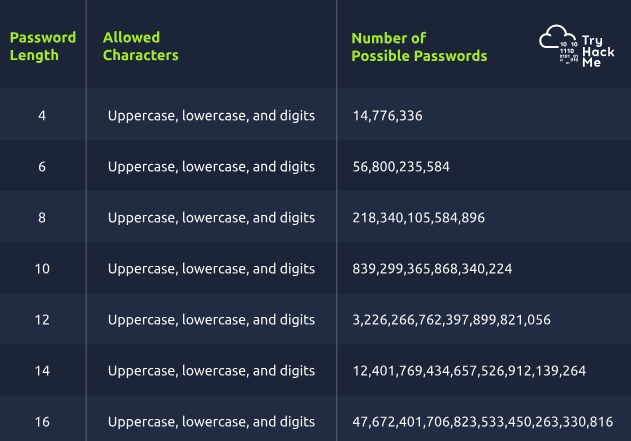
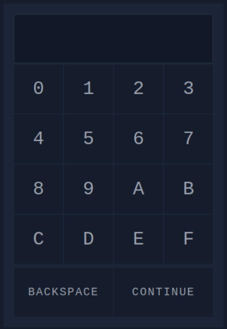

# Hydra is Coming to Town
#Brute-Forcing

Disrupting business operations and stop gifts from being delivered on time. Now, the team must resort to backup tapes to recover the systems. To their surprise, they find out they can’t unlock the IT room door! The password to access the control systems has been changed. The only solution is to hack back in to retrieve the backup tapes.

### Learning Objectives
- Password complexity and the number of possible combinations
- How the number of possible combinations affects the feasibility of brute force attacks
- Generating password combinations using `crunch`
- Trying out passwords automatically using `hydra`

### Counting the Passwords
Let’s consider an imaginary scenario where the password is exactly four characters, and each character can be: 
A digit: We have 10 digits (0 to 9) 
An uppercase English letter: We have 26 letters (A to Z) 
A lowercase English letter: We have 26 letters (a to z) 

### How Long Does It Take To Brute Force the Password
14 million is a huge number, but we can use a computer system to try out all the possible password combinations, i.e., brute force the password. If trying a password takes 0.001 seconds due to system throttling (i.e., we can only try 1,000 passwords per second), finding the password will only take up to four hours.

If you are curious about the maths, 624×0.001 = 14, 776 seconds is the number of seconds necessary to try out all the passwords. We can find the number of hours needed to try out all the passwords by dividing by 3,600 (1 hour = 3,600 seconds): 14,776/3,600 = 4.1 hours.

In reality, the password can be closer to the beginning of the list or closer to the end. Therefore, on average, we can expect to find the password in around two hours, i.e., 4.1/2 = 2.05 hours. Hence, a four-character password is generally considered insecure.

We should note that in this hypothetical example, we are assuming that we can try 1,000 passwords every second. Few systems would let us go this fast. After a few incorrect attempts, most would lock us out or impose frustratingly long waiting periods. On the other hand, with the password hash, we can try passwords offline. In this case, we would only be limited by how fast our computer is.

We can make passwords more secure by increasing the password complexity. This can be achieved by specifying a minimum password length and character variety. For example, the character variety might require at least one uppercase letter, one lowercase letter, one digit, and one symbol.

`Throughout this task, we will be using the IP address of the virtual machine, 10.10.130.97, as it’s hosting the login page.`

## Generating the Password List
### Crunch
> crunch 3 3 0123456789ABCDEF -o 3digits.txt

The command above specifies the following:
- 3 the first number is the minimum length of the generated password
- 3 the second number is the maximum length of the generated password
- 0123456789ABCDEF is the character set to use to generate the passwords
- -o 3digits.txt saves the output to the 3digits.txt file

### Hydra
Manually trying out PIN codes is a very daunting task. Luckily, we can use an automated tool to try our generated digit combinations. One of the most solid tools for trying passwords is Hydra.

`hydra -l '' -P 3digits.txt -f -v 10.10.182.22 http-post-form "/login.php:pin=^PASS^:Access denied" -s 8000`

The command above will try one password after another in the 3digits.txt file. It specifies the following:

-l '' indicates that the login name is blank as the security lock only requires a password 
-P 3digits.txt specifies the password file to use 
-f stops Hydra after finding a working password 
-v provides verbose output and is helpful for catching errors 
10.10.182.22 is the IP address of the target 
http-post-form specifies the HTTP method to use 
"/login.php:pin=^PASS^:Access denied" has three parts separated by :  
/login.php is the page where the PIN code is submitted 
pin=^PASS^ will replace ^PASS^ with values from the password list 
Access denied indicates that invalid passwords will lead to a page that contains the text “Access denied” 
-s 8000 indicates the port number on the target 

Output gives you the pin which when entered, will give you the flag.
PIN: 6F5
Flag: THM{pin-code-brute-force}