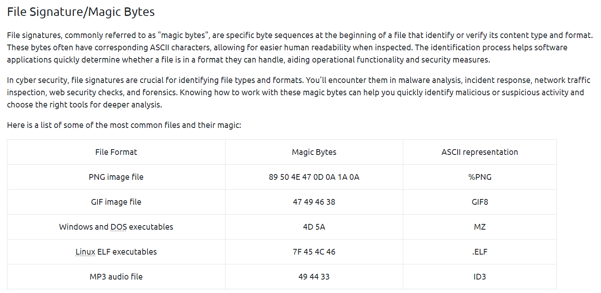
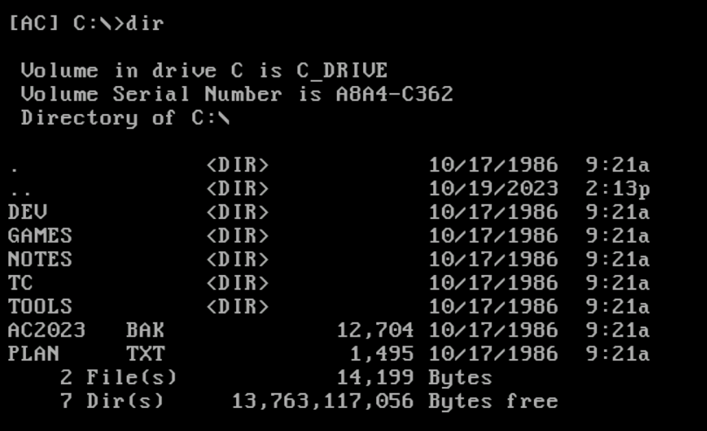
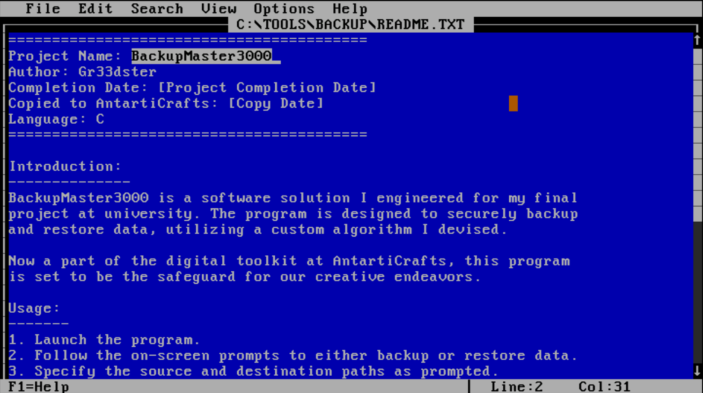
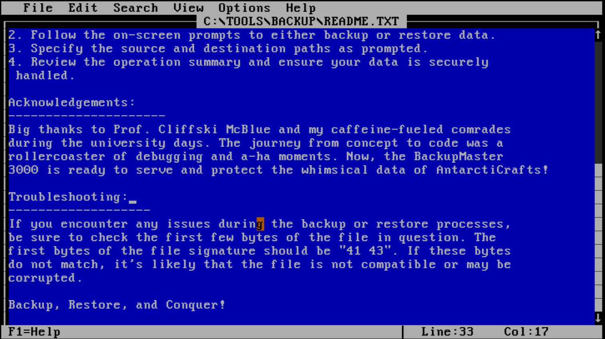
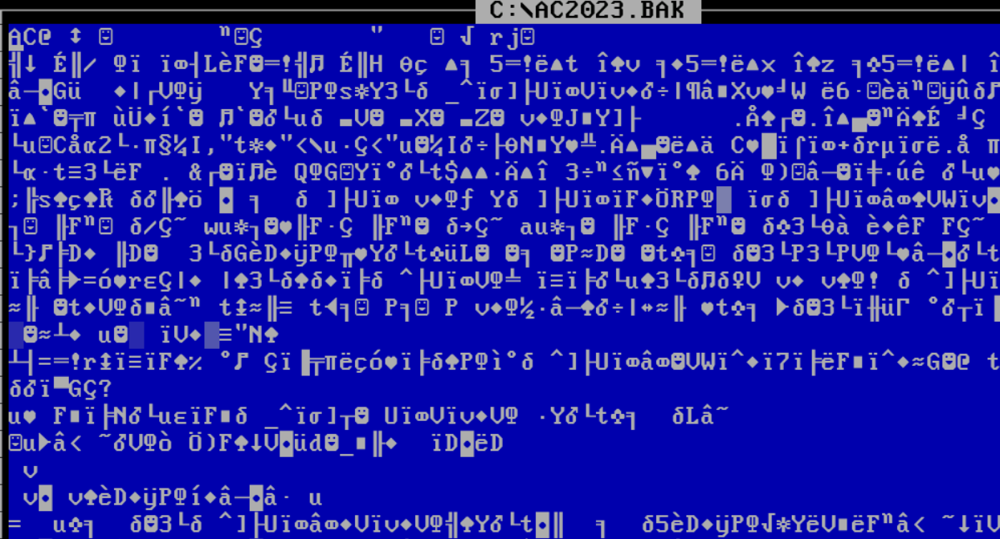
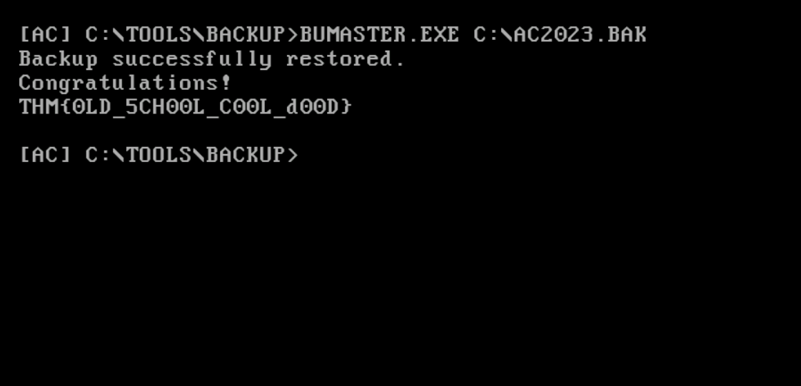

# A Christmas DOScovery: Tapes of Yule-tide Past
#Reverse engineering

The backup tapes have finally been recovered after the team successfully hacked the server room door. However, as fate would have it, the internal tool for recovering the backups can't seem to read them. While poring through the tool's documentation, you discover that an old version of this tool can troubleshoot problems with the backup. But the problem is, that version only runs on DOS (Disk Operating System)!

### Learning Objectives
- Experience how to navigate an unfamiliar legacy system.
- Learn about DOS and its connection to its contemporary, the Windows Command Prompt.
- Discover the significance of file signatures and magic bytes in data recovery and file system analysis.

### MS-DOS
The Disk Operating System was a dominant operating system during the early days of personal computing. Microsoft tweaked a DOS variant and rebranded it as MS-DOS, which later served as the groundwork for their graphical extension, the initial version of Windows OS. The fundamentals of file management, directory structures, and command syntax in DOS have stood the test of time and can be found in the command prompt and PowerShell of modern-day Windows systems.

1. How large (in bytes) is the AC2023.BAK file? 
 
Answer: 12,704

2. What is the name of the backup program? 
 
Answer: BackupMaster3000

3. What should the correct bytes be in the backup's file signature to restore the backup properly? 
 
Answer: 41 43

4. What is the flag after restoring the backup successfully?  
Convert XX to AC (41 43 in ASCII) 
 

 

Flag: THM{0LD_5CH00L_C00L_d00D}

Happy to help McHoneyBell

Signing off, 
A93N7_V1KRAM