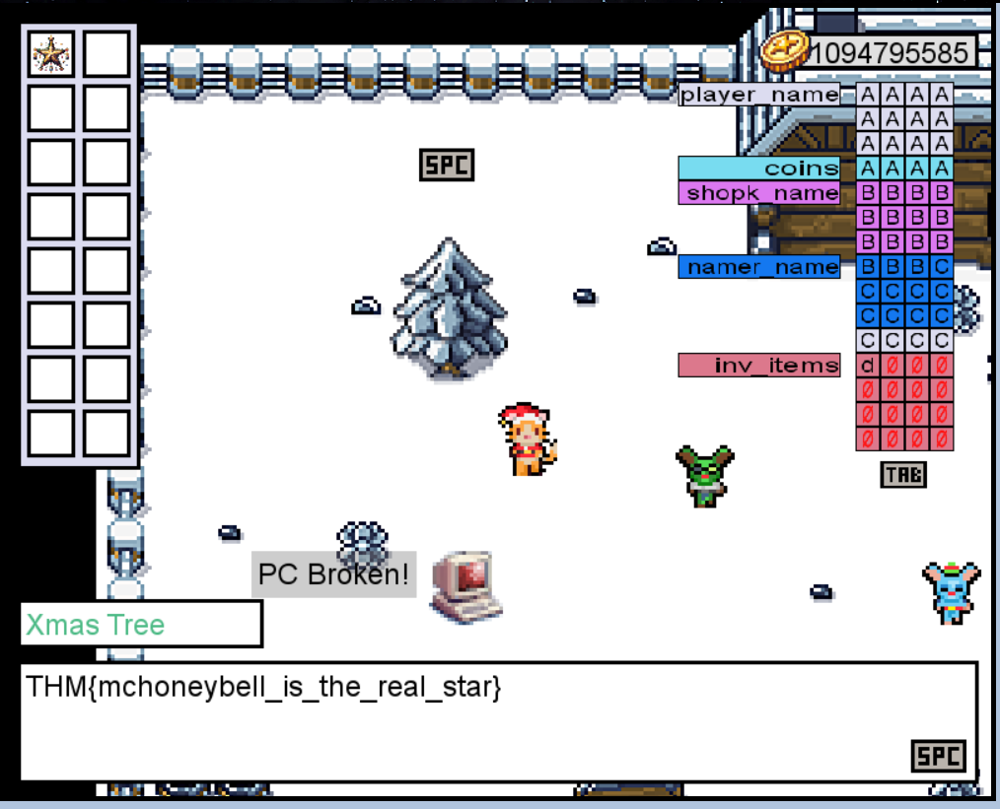

# Memories of Christmas Past
#Memory Corruption

### Learning Objectives
- Understand how specific languages may not handle memory safely.
- Understand how variables might overflow into adjacent memory and corrupt it.
- Exploit a simple buffer overflow to directly change memory you are not supposed to access.

In this game, you'll play as CatOrMouse. Your objective is to save Christmas by buying the star for your Christmas tree from Van Frosty. In addition to the star, you can buy as many ornaments as you can carry to decorate your tree. To gain money to buy things, you can use the computer to do online freelance programming jobs.

Van Jolly explains that when you change your name to anything large enough, the game goes nuts! Sometimes, you'll get random items in your inventory. Or, your coins just disappear. Even the dialogues can stop working and show random gibberish. This must surely be the work of magic!

McHoneyBell doesn't look convinced. After some thinking, she seems to know what this is all about.

Honeybell says a debugger will be needed to check the memory contents while the game runs. On hearing that, Van Sprinkles says they programmed a debug panel into the game that does exactly that. This will make it easier for us!

- Debug Panel

The game doesn't check if the player_name variable has enough space to store the new name. Instead, it keeps writing to adjacent memory, overwriting the values of other variables. This vulnerability is known as a buffer overflow and can be used to corrupt memory right next to the vulnerable variable.

Buffer overflows occur in some programming languages, mostly C and C++, where the variables' boundaries aren't strict. If programmers don't check the boundaries themselves, it's possible to abuse a variable to read or write memory beyond the space initially reserved for it. Our game is written in C++.

1. If the coins variable had the in-memory value in the image below, how many coins would you have in the game?

`4f 4f 50 53`  
Input: 53504f4f  
Answer: 1397772111  

2. What is the value of the final flag?

Just Increasing coins by buffer overflow to the coins memory is not enough, as the seller is not selling star. 
Let's Do it again buffer overflow to the inventory.  
44(some chars) + d  
AAAAAAAAAAAABBBBBBBBBBBBCCCCCCCCCCCCCCd  
Gives you star  
 
Flag: THM{mchoneybell_is_the_real_star}

Happy to help McHoneyBell

Signing off, 
A93N7_V1KRAM