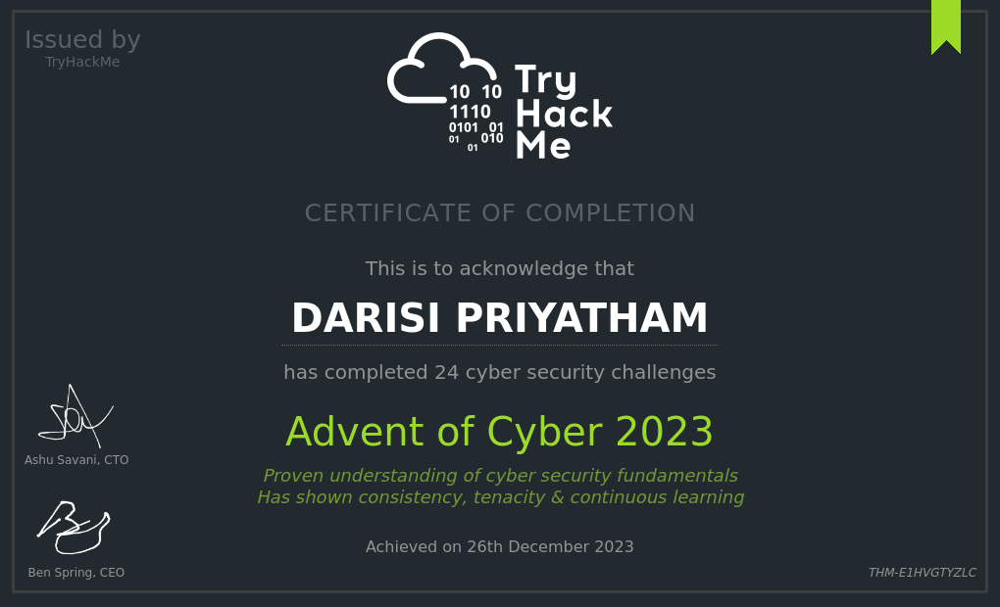

# Advent of Cyber 2023

 -- *A93N7_V1KRAM* 

 

A93N7_V1KRAM - a B.tech Cyber Security ***Student*** studying B.tech CSE in Spec with Cyber Security in IIIT Kottayam 
A93N7_V1KRAM - a avid ***CTF Player***, participated in more than 15+ CTFs (Part of the Institute team) 
A93N7_V1KRAM - a ***Leader*** managing the Cyber Security Club IIIT Kottayam, OWASP Chapter IIIT Kottayam 
A93N7_V1KRAM - a ***Speaker*** delivered 3 Webinars on Cyber Security. 
A93N7_V1KRAM - a ***Explorer*** exploring Comptia Security+, EC-Council Ethical Hacker, Google Cyber Security Certifications on Coursera, and more

🚀 Embarking on a thrilling journey with A93N7_V1KRAM as he delves into the world of #penetrationtesting, #securityengineering, #securityoperations, #machinelearning, #malwareanalysis, and #digitalforensics. 🌐

🤝 As the go-to friend, A93N7_V1KRAM learns that McHoneyBell is in a bind. Without hesitation, he rises to the occasion, ready to tackle the challenges head-on.

🔍 Join us day by day as A93N7_V1KRAM faces and overcomes obstacles, sharing his experiences from the Advent of Cyber 2023. Witness the journey of camaraderie, problem-solving, and ultimate success.

Ready to unravel the details? Dive into each day's account to discover how A93N7_V1KRAM navigated the complexities and triumphed alongside McHoneyBell by solving the Advent of Cyber 2023 by **Try Hack Me**.

*Hang-On, other day's walkthroughs waiting in the Local Machine, will be pushed to git soon.

> Please feel free to share your thoughts on this, looking for suggestions and support.
> Looking for *Internships* in **Cyber Security**, eager to apply the knowledge hands-on and learn more.

Badge A93N7_V1KRAM got:  

Certificate A93N7_V1KRAM received: 
